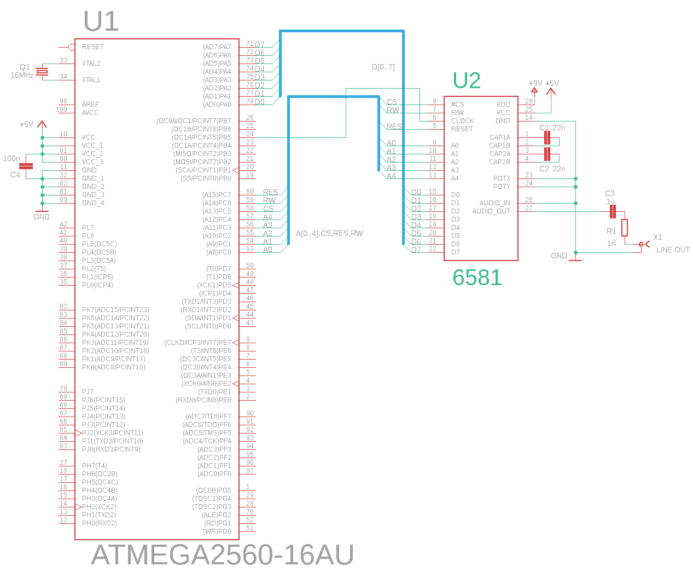

# NorSID
NorSID is a simple SID chip based serial port synthesizer.
It was one of my hobby projects. I had found a couple of 6581 and 8580 SID
ICs in my drawer and decided to come them to life again. An Arduino Mega
2560 board is used to drive the SID. The NorSID device can be controlled through
serial port using a custom protocol. A windows desktop client has
also been made which can be used to access the features of the connected SID
device.

The firmware can be built using AtmelStudio.
The desktop client is written in C#/.NET and can be built using VisualStudio.

 

## Schematic

## NorSID serial protocol

### Legend
\# = hexadecimal digit (0-F) 
\$ = decimal digit (0-9) 
@ = binary digit (0 or 1) 
NN = musical note (C. D. E. F. G. A. B. D$ E$ F$ G$ A$) 
UB = upper byte 
LB = lower byte
TT = transpose (-6 .. 6) (two hexadecimal digits, 2's complement)
FF = fine tune (-24 .. 24) (two hexadecimal digits, 2's complement)

| Command | Description | Scope | Example |
| ------- | ----------- | ----- | ------- |
| i | Get the version of the NorSID firmware | Device | i |
| r | Reset the SID chip | Device | r |
| d | Play the demo sound | Device | d |
| w#### | Write value directly into a SID register. UB##=address of the register in hexa (00-1B), LB##=value in hexa (00-FF) | Device | w03A1 |
| m# | Set the master volume. #=volume in hexa (0-F) | Device | mA |
| v# | Selects voice channel. All voice operations use the selected channel. (1-3) | Device | v2 |
| 0 | Gate off | Voice | 0 |
| 1 | Gate on | Voice| 1 |
| f$$$$.$$ | Set frequency in Hz | Voice | f404.24 |
| a#### | Set ADSR envelop. | Voice | a23AF |
| t# | Set waveform. 0=mute, 1=noise, 2=saw, 3=triangle, 4=square | Voice | t4 |
| Tnnnn | Set multi waveform. | Voice | T0101 |
| p### | Set pulse width. (3 hexa digits) | Voice | p1C4 |
| Fl | Set low pass filter mode. | Device | Fl |
| Fh | Set high pass filter mode. | Device | Fh |
| Fb | Set bypass filter mode. | Device | Fb |
| F0 | Disable filters. | Device | F0 |
| Fc### | Set filter cutoff frequency. (3 hexa digits) | Device | FcAA8 |
| Fr# | Set filter resonance. (1 hexa digit) | Device | Fr7 |
| Fe@@@ | Enable filter for voices. Voice1, Voice2, Voice3 | Device | Fe001 |
| Ff@@@ | Set filter mode. LP, BP, HP | Voice | Ff111 |
| c# | Set control register | Voice | c2 |
| * | All voice off | Device | * |
| nNN#TTFF | Set frequency by note. NN=note (e.g. F$, A.); #=octave 0..7; TT=transpose -6..+6 in hex, FF=fine tune -24..+24 in hex | Voice | nC.30000 |
